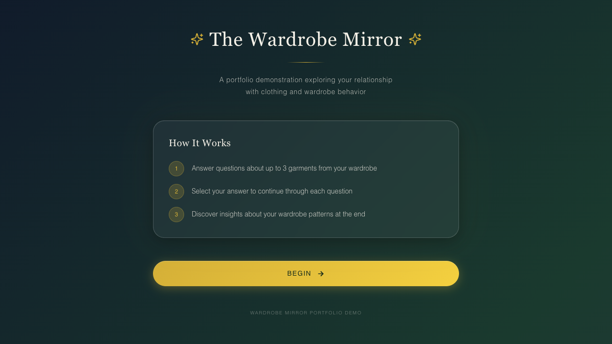

# Wardrobe Mirror

## A mobile-first research software case study

Wardrobe Mirror is a mobile-first reflection tool that compares stated clothing values with garment-level behaviour. It turns a multi-step research interaction into a clear, responsive experience and produces a personal value fingerprint and behavioural archetype.



## The challenge

Sustainability research often needs more than a questionnaire, participants need an accessible way to reflect on choices around acquiring, using and letting go of clothing. The project needed a coherent research instrument, a usable digital experience and a transparent way to translate responses into meaningful feedback.

## My role

I served as Scrum Master, lead application developer, research and scoring-methodology lead, Python analyst and lead writer of the final report.

## What I delivered

- Coordinated iterative delivery during the research-design and development phase.
- Re-engineered the initial prototype into a modular React and TypeScript application with automated scoring and tests.
- Developed the research and scoring methodology, analysed pilot and full-scale session data in Python, and integrated team and stakeholder feedback into the final report.

## Evidence and outcomes

- Pilot: 39 participants and 230 garment records.
- Full-scale round: 109 sessions, including 77 clean sessions.
- The scoring approach is transparent and theory-aligned.

## Architecture

The application uses React, TypeScript and Vite. The interaction flow, response model, scoring engine, persona logic and visualisation components are separated into focused modules. Automated tests cover scoring, response handling and the portfolio submission boundary.

See the [portfolio methodology note](docs/portfolio-methodology.md) for a high-level explanation of the reflection model.

## Responsible portfolio boundary

This repository is a non-persistent portfolio demonstration. It neither connects to nor deploys the live research system. Completing the portfolio demo keeps responses in the browser; optional CSV and JSON exports are generated locally for the visitor.

The [live research application](https://wardrobe-mirror-app.vercel.app) is a separate system. This repository does not control or deploy it.

## Run locally

```bash
pnpm install
pnpm dev
```

For verification:

```bash
pnpm typecheck
pnpm test
pnpm build
```

## Credits

Developed through Digital Society School and Amsterdam Fashion Institute.

Portfolio review only. All rights reserved.
